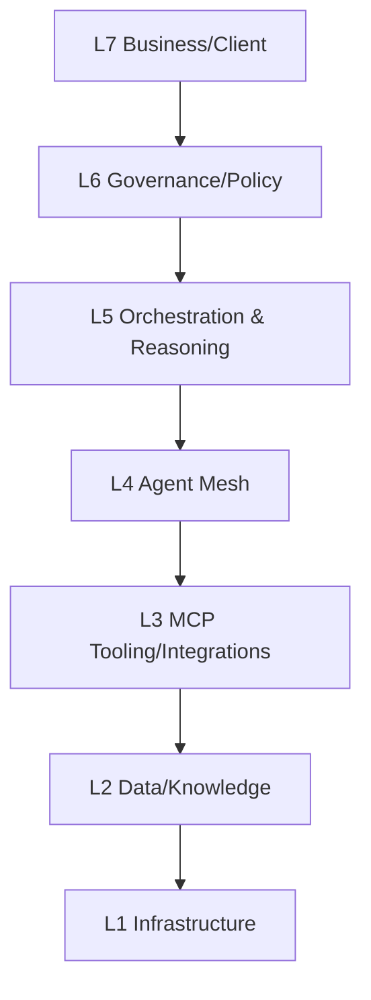

```mermaid
graph TD
  L7[L7 Business/Client] --> L6[L6 Governance/Policy]
  L6 --> L5[L5 Orchestration & Reasoning]
  L5 --> L4[L4 Agent Mesh]
  L4 --> L3[L3 MCP Tooling/Integrations]
  L3 --> L2[L2 Data/Knowledge]
  L2 --> L1[L1 Infrastructure]
```
