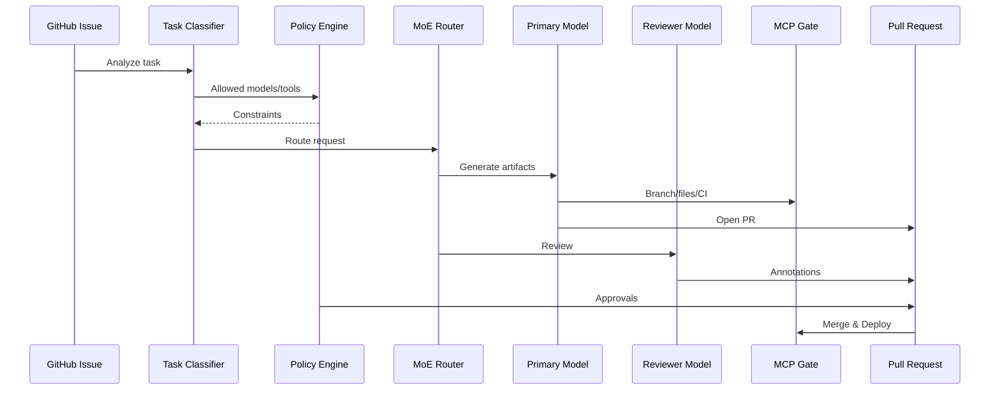

```mermaid
sequenceDiagram
  participant Issue as GitHub Issue
  participant Class as Task Classifier
  participant Policy as Policy Engine
  participant MoE as MoE Router
  participant Maker as Primary Model
  participant Critic as Reviewer Model
  participant MCP as MCP Gate
  participant PR as Pull Request

  Issue->>Class: Analyze task
  Class->>Policy: Allowed models/tools
  Policy-->>Class: Constraints
  Class->>MoE: Route request
  MoE->>Maker: Generate artifacts
  Maker->>MCP: Branch/files/CI
  Maker->>PR: Open PR
  MoE->>Critic: Review
  Critic->>PR: Annotations
  Policy->>PR: Approvals
  PR->>MCP: Merge & Deploy
```
