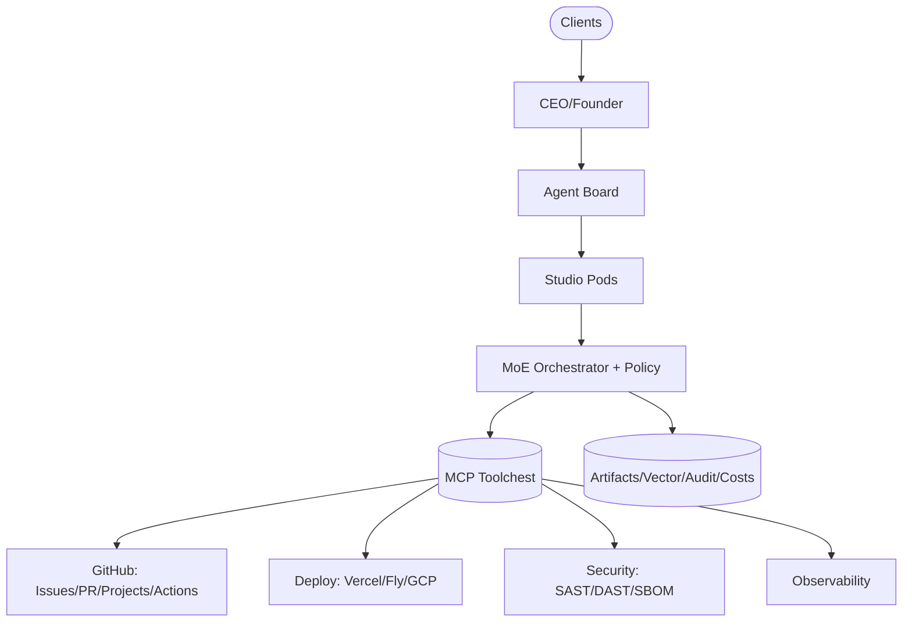

```mermaid
flowchart TD
  Client([Clients]) --> CEO[CEO/Founder]
  CEO --> Board[Agent Board]
  Board --> Pods[Studio Pods]
  Pods --> Orchestrator[MoE Orchestrator + Policy]
  Orchestrator --> MCP[(MCP Toolchest)]
  MCP --> GitHub[GitHub: Issues/PR/Projects/Actions]
  MCP --> Deploy[Deploy: Vercel/Fly/GCP]
  MCP --> Sec[Security: SAST/DAST/SBOM]
  MCP --> Obs[Observability]
  Orchestrator --> Data[(Artifacts/Vector/Audit/Costs)]
```
