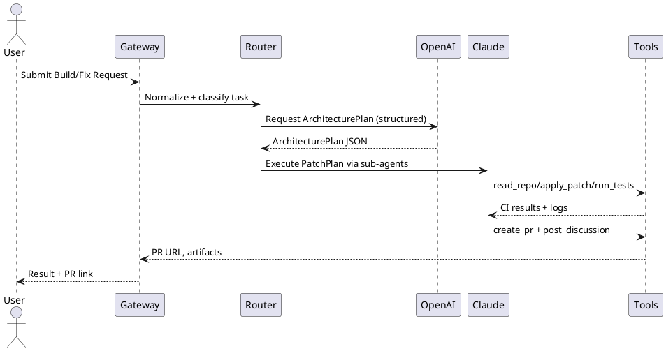

# Diagrams (Mermaid/PlantUML)

## Multi-Layer (Mermaid)

```mermaid
flowchart TD
  U[User/Client] --> G[Gateway/API]
  G --> R[Router (Policy+Telemetry)]
  R -->|Plan| P(OpenAI Planning Lane)
  R -->|Edit| C(Claude Sub-Agents Lane)
  R -->|Codemod| O(Open-Source Local Lane)
  R -->|QA| Q(Compliance & QA)
  C --> T[Tool Surface]
  P --> T
  O --> T
  Q --> T
  T --> GH[GitHub PRs/Issues/Actions]
  subgraph Data
    CS[(Contracts Store)]
    ST[(State/Cache)]
  end
  G --> CS
  R --> ST
  T --> CS
```

## Sequence (PlantUML)


